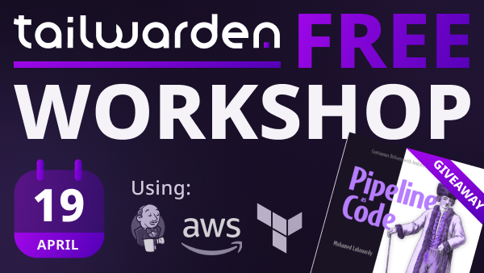
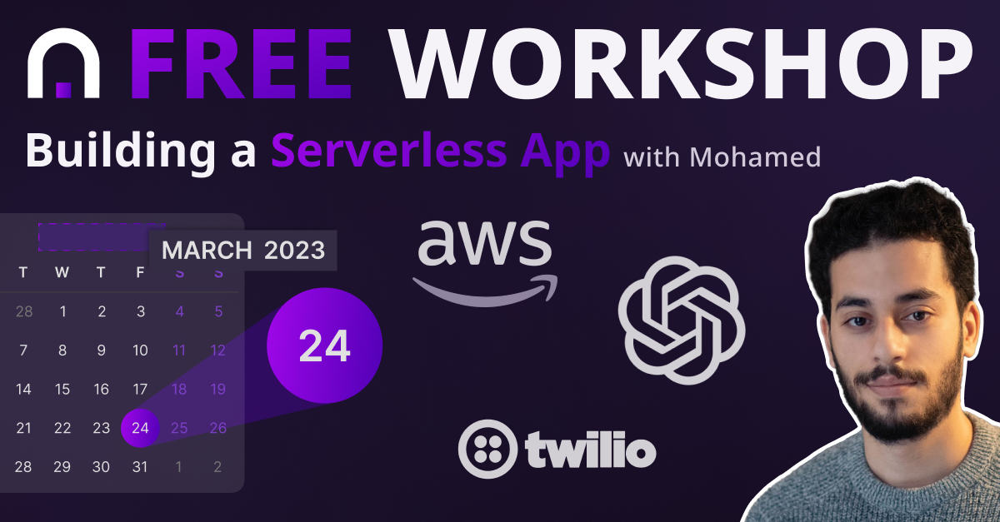

# Wardens Assembly Workshops

## Workshops

### Build a Jenkins cluster on AWS w/ Terraform

Free Workshop on how to build a Jenkins cluster on AWS with Terraform and Packer and how to build a CI/CD pipeline for a Serverless app.

What's included

1️⃣ Baking machine images with Packer  
2️⃣ Discovering Jenkins as Code with Terraform  
3️⃣ Deploying Jenkins cluster on AWS  
4️⃣ Building a CI/CD pipeline for a Serverless app  

In case you missed the event, you can watch it again:

### Build a Gym workout Generator on AWS Lambda w/ ChatGPT + Twilio

Free Workshop on how to build a serverless gym app that sends a workout plan directly to your WhatsApp using ChatGPT + Twilio.

What's included

1️⃣ Building a Serverless app using Golang & AWS Lambda  
2️⃣ Scheduling Lambda with cron expression triggers  
3️⃣ Integrating ChatGPT 4 with AWS Lambda  
4️⃣ Sending WhatsApp messages via the Twilio SDK  
5️⃣ Streamlining deployment with GitHub Actions & AWS SAM  
 
In case you missed the event, you can watch it again:

Create a similar serverless app that integrates with ChatGPT and share it on Twitter, to enter the competition tag [Tailwarden on Twitter](https://twitter.com/tailwarden) and add the hastag #WardensAssemblyChallenge. The 3 winners will be chosen on Friday April 28th.
